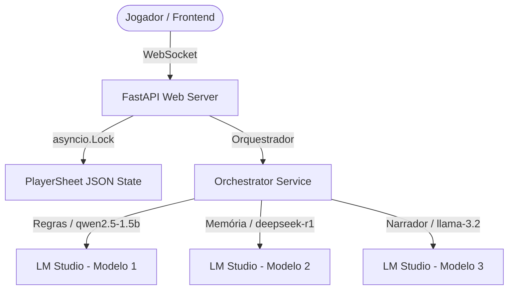

<div align="center">
  
  
  # Agente Storyteller | Motor Narrativo V5 🦇
  
  **Um motor de RPG de mesa assíncrono e de alto desempenho projetado para mestrar 'Vampiro: A Máscara 5ª Edição' utilizando processamento local paralelo, concorrência atômica, streaming em tempo real e frontend modular em React.**
  
  [](LICENSE)
  [](https://react.dev/)
  [](https://fastapi.tiangolo.com/)
  [](https://www.typescriptlang.org/)

</div>

---

## 📖 Visão Geral (Storytelling Técnico)

O **Agente Storyteller** é um motor de orquestração local de Inteligência Artificial concebido sob as diretrizes de **Engenharia de Software Acelerada por IA**. Criado com a finalidade de atuar como o Mestre de Jogo do universo de 'Vampiro: A Máscara', o sistema superou as limitações de latência criativa e gargalos de concorrência dos setups tradicionais de IA. 

Anteriormente estruturado em Vanilla JS com concorrência frágil (causando perdas de dados nas atualizações simultâneas de fichas), o ecossistema foi refatorado para incorporar um backend assíncrono robusto em FastAPI Python e um frontend moderno baseado em React com tipagem TypeScript estrita e Tailwind CSS v4. A orquestração distribui de forma inteligente as requisições entre três modelos locais em execução paralela, garantindo fidelidade absoluta às regras oficiais e imersão narrativa sob zero latência criativa.

> [!NOTE]
> Este é o **repositório de desenvolvimento (Core)**. Para acessar a versão de distribuição empacotada e higienizada focada exclusivamente na experiência final de jogo do jogador, acesse: [Agente Storyteller - Distribuição Pública](https://github.com/CHCLopes/AgenteStorytellerGame_Public).

---

## 🎨 Showcase Visual

A interface do usuário do frontend foi projetada para acomodar o clima gótico sem degradar a legibilidade e acessibilidade. 

| Tema | Paleta de Cores | Contraste e Acessibilidade (WCAG AA) |
|---|---|---|
| **Dark Mode (Padrão)** | Crimson (#990000) + Charcoal (#121212) | Contraste de alto nível para sessões de jogo noturnas; redução de fadiga ocular. |
| **Light Mode (Gótico)** | Terra Gasta (#8B4513) + Pergaminho (#F5F5DC) | Simula folhas de fichas de papel antigas; foco em legibilidade diurna e contraste semântico. |

---

## ⚡ Arquitetura & Stack de Engenharia

O motor divide-se em serviços independentes que evitam a sobrecarga computacional de modelos locais:



### Por que estas decisões de Engenharia?
*   **Atomicidade de Estado (`asyncio.Lock` + `aiofiles`)**: Garante que modificações em tempo real na ficha do jogador (XP, fome, frenesi) sejam gravadas sem colisões ou arquivos corrompidos.
*   **WebSockets & Streaming**: A geração de texto dos modelos locais é transmitida em tempo real para o frontend, eliminando a percepção de tempo de resposta longo de LLMs rodando em hardware doméstico.
*   **Segregação de Carga (3 Modelos Locais)**: Separar o Narrador, o Árbitro de Regras e a Memória do Mundo evita a alucinação de regras do sistema de jogo e otimiza o uso de VRAM.

---

## 🛠️ Developer Setup (Quickstart)

### Pré-requisitos
*   Python 3.11 ou superior
*   Node.js 18 ou superior
*   [LM Studio](https://lmstudio.ai/) ativo na porta padrão `1234`

### 1. Preparação do Ambiente e Backend
```bash
# Clone o repositório
git clone https://github.com/CHCLopes/AgenteStoryteller.git
cd AgenteStoryteller

# Criar e ativar ambiente virtual
python -m venv .venv
source .venv/Scripts/activate # No Windows

# Instalar dependências do backend
pip install -r requirements.txt
```

### 2. Instalação do Frontend
```bash
cd client
npm install
```

### 3. Execução em Desenvolvimento
Você pode utilizar o inicializador automático que valida as portas do LM Studio e orquestra a subida do servidor:
```bash
# Na raiz do repositório
python scripts/initialize_game.py
```
Ou rodar manualmente os servidores em terminais separados:
```bash
# Terminal 1 (Backend)
uvicorn api.main:app --host 127.0.0.1 --port 8000 --reload

# Terminal 2 (Frontend)
cd client
npm run dev
```

### 4. Executando os Testes
```bash
# Testes do Backend (Pytest)
pytest tests/

# Testes do Frontend (Vitest)
cd client
npm run test
```

---

## 📂 Topologia (File Tree)

```text
AgenteStoryteller/
├── api/                           # Backend FastAPI
│   ├── core/                      # Configurações centrais do sistema
│   ├── main.py                    # Entrypoint uvicorn e rotas do servidor
│   ├── orchestrator_service.py    # Orquestração paralela dos 3 LLMs
│   └── rules_service.py           # Mecânicas do sistema de regras V5
├── client/                        # Frontend React 19 / TypeScript
│   ├── src/                       # Componentes, hooks e lógica do HUD
│   │   ├── components/            # Ficha de jogador, logs de rolagens e HUD
│   │   └── App.tsx                # Renderizador principal da SPA
│   ├── package.json               # Dependências frontend (Vite, Tailwind v4)
│   └── vite.config.ts             # Configuração de bundler e testes
├── data/                          # Dados de persistência do jogador (PlayerSheet)
├── scripts/                       # Scripts auxiliares e automatizadores
│   └── initialize_game.py         # Script de auto-inicialização inteligente
├── tests/                         # Testes automatizados da aplicação
└── INICIAR_JOGO.bat               # Atalho de execução rápida para usuários
```

---

## 🛠️ Guia de Manutenção Dev-para-Dev

*   **Isolamento de Estado**: Qualquer alteração nas estatísticas ou atributos do jogador no frontend deve enviar um payload JSON via WebSocket para as rotas do FastAPI. Evite mutar estados de forma local e persistente no React sem sincronizar com o backend.
*   **Adição de Novas LLMs**: Para integrar novos modelos de linguagem locais, edite o arquivo [orchestrator_service.py](file:///c:/Users/skate/Desktop/WorkSpace/Antigravity/SandBox/AgenteStoryteller/api/orchestrator_service.py) e inclua as definições de endpoint correspondentes.
*   **Padrão Estritamente Modular de Dados**: Siga a segregação estrita das métricas e logs em tabelas/arquivos específicos (como o isolamento do estado da crônica em relação ao histórico de rolagens), garantindo a scalabilidade futura para bancos de dados relacionais dedicados.

---

<div align="center">
  
  Desenvolvido e mantido sob rígidos padrões de engenharia e otimização local. 🦇✨
  
  [](https://www.linkedin.com/in/carlos-lopes-b445aa201)
  [](https://github.com/CHCLopes)

</div>
